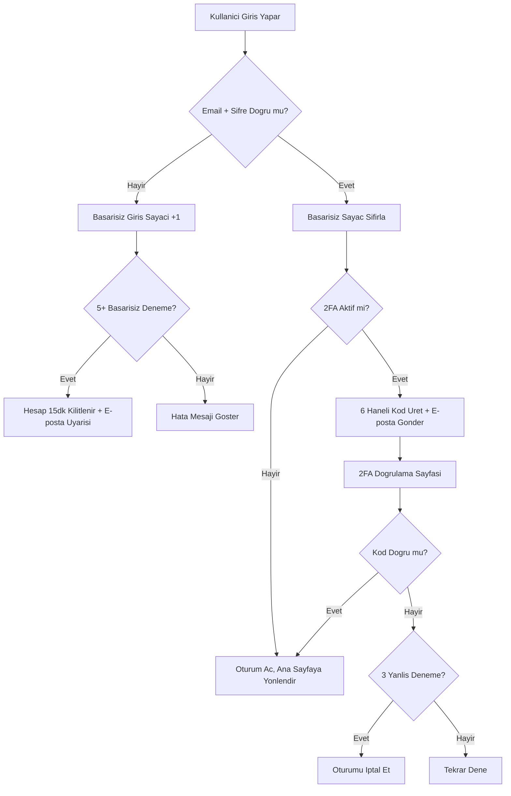
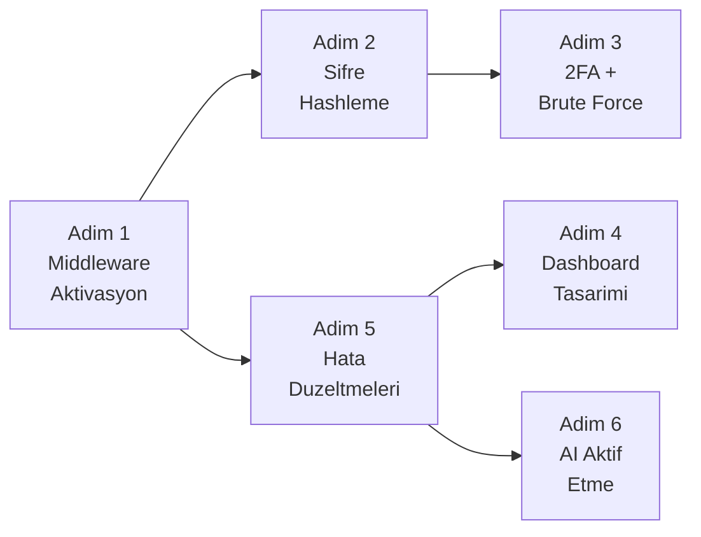

# Kartist - Hafta 1-2 Uygulama Plani

## Mevcut Durum Analizi

| Alan | Durum | Risk |
|------|-------|------|
| SQL Injection | Dapper parametrize sorgular kullaniliyor (iyi), `InputValidator` blacklist yaklasimi (zayif) | Dusuk |
| XSS | Temel regex sanitizasyon + Razor otomatik encoding | Orta |
| CSRF | Bazi formlarda var, tutarsiz uygulama | Orta |
| Security Headers | `SecurityHeadersMiddleware.cs` yazilmis ama **aktif degil** | Yuksek |
| Rate Limiting | `RateLimitingMiddleware.cs` yazilmis ama **aktif degil** | Yuksek |
| Sifre Saklama | **Duz metin** (plain text) - Kritik acik | Kritik |
| 2FA | Yok | Yuksek |
| Dashboard | Basit profil sayfasi, portfolyo gorunumu yok | - |
| AI Editör | Backend + Frontend mevcut, aktif etme gerekli | - |
| Sifre Degistir | Frontend formu var, backend bagli degil | Bug |

---

## Adim 1: Guvenlik Middleware Aktivasyonu ve Sertlestirme

**Hedef**: Mevcut ama pasif olan guvenlik katmanlarini aktif etmek.

### 1.1 - `Program.cs` Middleware Pipeline Guncelleme
- `SecurityHeadersMiddleware` aktif et (`app.UseMiddleware<SecurityHeadersMiddleware>()`)
- `RateLimitingMiddleware` aktif et (`app.UseRateLimiting()`)
- Siralama: `UseHttpsRedirection` > `UseSecurityHeaders` > `UseRateLimiting` > `UseStaticFiles` > `UseRouting` > ...
- `appsettings.json`'daki `Security` ayarlarini middleware'e bagla

### 1.2 - CSRF Korumasini Global Yap
- `Program.cs`'de `services.AddControllersWithViews(options => options.Filters.Add(new AutoValidateAntiforgeryTokenAttribute()))` ekle
- Bu sayede tum POST/PUT/DELETE istekleri otomatik CSRF kontrolunden gececek
- AJAX istekleri icin global header middleware veya `[IgnoreAntiforgeryToken]` kullanimi duzenleme

### 1.3 - `InputValidator.cs` Guclendir
- Blacklist yaklasimi kaldirilmayacak (geriye uyumluluk), ama **whitelist tabanli** yeni metotlar eklenecek
- `SanitizeHtml` metodunu **HtmlSanitizer NuGet paketi** ile guclendir (regex yerine)
- Yeni metot: `SanitizeForDisplay(string input)` - HTML entity encoding
- Yeni metot: `IsValidPrompt(string input)` - AI prompt icin ozel validasyon

**Degisecek Dosyalar**:
- `Program.cs` (middleware pipeline)
- `Helpers/InputValidator.cs` (yeni metotlar)

---

## Adim 2: Sifre Hashleme (Kritik Guvenlik)

**Hedef**: Duz metin sifreleri hash'li sifrelere donusturmek.

### 2.1 - Sifre Hash Altyapisi
- `Helpers/PasswordHasher.cs` olustur
- `BCrypt.Net-Next` NuGet paketi kullan
- Metotlar: `HashPassword(string plain)` ve `VerifyPassword(string plain, string hashed)`

### 2.2 - Kayit Akisini Guncelle
- `AccountController.Kayit()` - Sifreyi hash'leyerek kaydet

### 2.3 - Giris Akisini Guncelle
- `AccountController.Giris()` - Veritabaninan hash'i cek, `VerifyPassword` ile dogrula
- SQL sorgusunu degistir: `WHERE Email = @e` (sifre karsilastirmasi kod tarafinda)

### 2.4 - Sifre Sifirlama Guncelle
- `AccountController.SifreSifirla()` - Yeni sifreyi hash'leyerek kaydet

### 2.5 - Mevcut Kullanicilarin Goc Stratejisi
- Giris sirasinda eski duz metin sifreyi kontrol et, basarili ise hash'leyerek guncelle (lazy migration)
- Bu sayede mevcut kullanicilar sifrelerini degistirmek zorunda kalmaz

**Degisecek Dosyalar**:
- Yeni: `Helpers/PasswordHasher.cs`
- `Controllers/AccountController.cs` (Giris, Kayit, SifreSifirla)

---

## Adim 3: Suphelie Giris Tespiti ve 2FA Altyapisi

**Hedef**: Brute-force korumasini ve e-posta onay kodlu 2FA'yi kurmak.



### 3.1 - Veritabani Degisiklikleri (SQL)
```sql
-- Kullanicilar tablosuna yeni alanlar
ALTER TABLE Kullanicilar ADD 
    BasarisizGirisSayisi INT DEFAULT 0,
    HesapKilitliMi BIT DEFAULT 0,
    KilitBitisTarihi DATETIME NULL,
    IkiFactorAktif BIT DEFAULT 0;

-- 2FA kodlari tablosu
CREATE TABLE IkiFactorKodlari (
    Id INT IDENTITY(1,1) PRIMARY KEY,
    KullaniciEmail NVARCHAR(256) NOT NULL,
    Kod NVARCHAR(6) NOT NULL,
    OlusturmaTarihi DATETIME DEFAULT GETUTCDATE(),
    BitisTarihi DATETIME NOT NULL,
    Kullanildi BIT DEFAULT 0
);

-- Giris log tablosu (suphelie tespit icin)
CREATE TABLE GirisLoglari (
    Id INT IDENTITY(1,1) PRIMARY KEY,
    KullaniciEmail NVARCHAR(256),
    IpAdresi NVARCHAR(50),
    BasariliMi BIT,
    Tarih DATETIME DEFAULT GETUTCDATE(),
    UserAgent NVARCHAR(500)
);
```

### 3.2 - `Kullanici.cs` Model Guncelle
- Yeni alanlar: `BasarisizGirisSayisi`, `HesapKilitliMi`, `KilitBitisTarihi`, `IkiFactorAktif`

### 3.3 - Brute-Force Korumasi
- `AccountController.Giris()` icine:
  - Hesap kilitli mi kontrol et
  - Basarisiz giriste sayaci artir
  - 5 basarisiz denemede hesabi 15dk kilitle
  - Kilitleme durumunda e-posta uyarisi gonder
  - Basarili giriste sayaci sifirla

### 3.4 - Giris Log Sistemi
- Her giris denemesini `GirisLoglari` tablosuna kaydet (IP, tarih, basari durumu, User-Agent)
- `AccountController`'a `LogGirisDenemesi()` private metodu ekle

### 3.5 - 2FA E-posta Dogrulama
- `AccountController`'a yeni action: `IkiFactorDogrula(string email, string kod)`
- `Views/Account/IkiFactorDogrula.cshtml` - 6 haneli kod giris sayfasi (modern UI, otomatik input focus)
- Giris basarili oldugunda: 2FA aktifse kod uret, e-posta gonder, dogrulama sayfasina yonlendir
- Kod 5 dakika gecerli, 3 yanlis denemede oturumu iptal et
- Profil ayarlarinda 2FA acma/kapama toggle'i

### 3.6 - 2FA Aktivasyon (Profil)
- Profil Ayarlar sekmesine "Iki Faktorlu Dogrulama" toggle ekle
- Aktif ederken once e-posta dogrulama kodu gonder
- `AccountController`'a: `IkiFactorAktifEt()` ve `IkiFactorKapat()` action'lari

**Degisecek Dosyalar**:
- `Models/Kullanici.cs`
- `Controllers/AccountController.cs` (Giris akisi, yeni action'lar)
- Yeni: `Views/Account/IkiFactorDogrula.cshtml`
- `Views/Account/Profil.cshtml` (Ayarlar sekmesine 2FA toggle)
- SQL: 2 yeni tablo + 1 ALTER TABLE

---

## Adim 4: Gelismis Dashboard / Portfolyo Tasarimi

**Hedef**: Profil sayfasini portfolyo tarzinda yeniden tasarlamak.

### 4.1 - Dashboard Ust Bolum Yenileme
- Mevcut `user-dashboard-card`'i genislet:
  - Buyuk profil resmi (hero banner alani)
  - Kullanici bio/aciklama alani (yeni DB alani: `Biyografi`)
  - Istatistik kartlari: Toplam Proje, Favori, Satis, Toplam Goruntulenme
  - Uyelik durumu badge + ilerleme cubugu (kredi)

### 4.2 - Portfolyo Grid Gorunumu
- Mevcut `projects-grid`'i gelismis portfolyo grid'e donustur:
  - Hover efektleri ile onizleme buyutme
  - Kategori filtreleme (ust kisma filtre butonu)
  - Grid/Liste gorunum degistirme toggle
  - Her kartta: onizleme, baslik, tarih, kategori etiketi, goruntulenme sayisi

### 4.3 - Yeni Sekmeler
- Mevcut sekmeler: Projelerim, Ayarlar, Favoriler
- Yeni sekme: **Portfolyom** (paylasima acik tasarimlar)
- Yeni sekme: **Aktivite** (son islemler: giris, tasarim kaydi, satis, vb.)

### 4.4 - Veritabani Degisiklikleri
```sql
ALTER TABLE Kullanicilar ADD 
    Biyografi NVARCHAR(500) NULL,
    SosyalMedya NVARCHAR(500) NULL;
```

### 4.5 - Profil Ayarlar Sekmesi Guncelleme
- Mevcut sifre degistir formunu **calisir hale getir** (backend baglantisi)
- Biyografi duzenleme alani ekle
- 2FA toggle ekle (Adim 3.6)

**Degisecek Dosyalar**:
- `Views/Account/Profil.cshtml` (buyuk guncelleme - HTML + CSS + JS)
- `Controllers/AccountController.cs` (SifreDegistir, BiyografiGuncelle action'lari)
- `Models/Kullanici.cs` (Biyografi, SosyalMedya)
- SQL: ALTER TABLE

---

## Adim 5: Hata Duzeltmeleri

### 5.1 - Profil Hatalari
- **Sifre degistir formu calismiyor**: Backend `SifreDegistir` action'i yok - olustur
- **Satis sayisi hardcoded "0"**: Veritabanindan gercek satis sayisini cek
- **`bulkActions` elementi eksik**: Profil HTML'de referans var ama element tanimli degil

### 5.2 - Editor Hatalari
- Editor icindeki hatalari tespit etmek icin `Tasarim.cshtml`'i detayli inceleyip kullaniciya hata listesi soracagiz (kullanicinin bildigi spesifik hatalara gore mudahale)

**Degisecek Dosyalar**:
- `Views/Account/Profil.cshtml`
- `Controllers/AccountController.cs`
- `Views/Home/Tasarim.cshtml` (editor hatalari)

---

## Adim 6: AI Editorunu Aktif Etme

**Hedef**: Editordeki AI tasarim onerisi ozelligini tam calisir hale getirmek.

### 6.1 - Mevcut AI Durum Kontrolu
- Backend: `HomeController.KartTasarimOner` - Groq API entegrasyonu **mevcut ve calisir gorunuyor**
- Frontend: `generateDesignFromPrompt()` fonksiyonu **mevcut**
- API Key: `appsettings.json` icinde tanimli

### 6.2 - AI Baglantisini Dogrulama ve Duzeltme
- AI sidebar'daki butonun `KartTasarimOner` endpoint'ine dogru baglandigini dogrula
- AJAX cagirisinda CSRF token'in gonderildigini kontrol et
- Hata mesajlarini kullaniciya duzgun goster (loading spinner, basari/hata durumu)
- `InputValidator` prompt validasyonunun AI promptlarini yanlis engellemediginden emin ol (orn: "select" kelimesi bir AI promptunda gecebilir)

### 6.3 - AI UX Iyilestirmeleri
- AI onerisi uretilirken loading animasyonu
- Sonuc geldiginde canvas'a otomatik uygulama + "Geri Al" secenegi
- Hata durumunda kullaniciya anlasilir mesaj

**Degisecek Dosyalar**:
- `Views/Home/Tasarim.cshtml` (AI sidebar JS)
- `Controllers/HomeController.cs` (gerekirse kuçuk duzeltmeler)
- `Helpers/InputValidator.cs` (AI prompt icin ozel kural)

---

## Uygulama Sirasi ve Bagimliliklar



| Sira | Adim | Bagimlilik | Oncelik |
|------|------|-----------|---------|
| 1 | Middleware Aktivasyonu | Yok | Yuksek |
| 2 | Sifre Hashleme | Adim 1 | Kritik |
| 3 | 2FA + Brute Force | Adim 2 | Yuksek |
| 4 | Hata Duzeltmeleri | Adim 1 | Orta |
| 5 | Dashboard Tasarimi | Adim 4 | Orta |
| 6 | AI Aktif Etme | Adim 4 | Orta |

---

## Dogrulama / Tamamlanma Kriterleri (DoD)

| Adim | Dogrulama |
|------|----------|
| 1 - Middleware | Tarayicida response header'larda `X-XSS-Protection`, `CSP`, `X-Frame-Options` gorunuyor. Rate limit 429 donuyor. CSRF korumasiz POST 400 donuyor. |
| 2 - Sifre Hash | Yeni kayit olan kullanicinin DB'deki sifresi `$2a$...` formatinda. Eski kullanici giris yapinca sifresi otomatik hash'leniyor. |
| 3 - 2FA | 5 yanlis giriste hesap kilitleniyor + e-posta gidiyor. 2FA aktif kullaniciya kod e-postasi gidiyor ve dogrulama calisiyor. `GirisLoglari` tablosu dolmuyor. |
| 4 - Dashboard | Profil sayfasi portfolyo gorunumunde, istatistikler gercek veriden geliyor, 2FA toggle calisiyor, sifre degistir calisiyor. |
| 5 - Hata Duzeltme | Bilinen hatalar giderilmis, sifre degistir formu calisir, `bulkActions` hatasi yok. |
| 6 - AI | Editorde AI prompt girildiginde Groq API'ye istek gidiyor, sonuc canvas'a yansıyor, hata durumu duzgun goruntuleniyor. |

---

## NuGet Paket Gereksinimleri
- `BCrypt.Net-Next` (sifre hashleme)
- `HtmlSanitizer` (opsiyonel - XSS korumasini guclendirmek icin)

## SQL Degisiklik Ozeti
- `Kullanicilar` tablosu: 6 yeni alan (BasarisizGirisSayisi, HesapKilitliMi, KilitBitisTarihi, IkiFactorAktif, Biyografi, SosyalMedya)
- Yeni tablo: `IkiFactorKodlari`
- Yeni tablo: `GirisLoglari`
