<p align="center">
  
</p>

<h1 align="center">⚡ KARTIST</h1>

<p align="center">
  <strong><em>"Tasarımın Geleceği, Senin Hayalin."</em></strong><br>
  Yapay Zekâ Destekli Modern Tasarım Stüdyosu &middot; Sosyal Tasarımcı Ağı
</p>

<p align="center">
  <a href="https://github.com/Keremcanatass-58/Kartist-Editor/actions/workflows/dotnet.yml">
    
  </a>
  
  
  
  
  
  
  
  <a href="https://kartistt.com.tr">
    
  </a>
</p>

<p align="center">
  <a href="#-proje-hakkında">Proje</a> &middot;
  <a href="#-öne-çıkan-özellikler">Özellikler</a> &middot;
  <a href="#-ekran-görüntüleri">Galeri</a> &middot;
  <a href="#-teknoloji-yığını">Teknoloji</a> &middot;
  <a href="#-sistem-mimarisi">Mimari</a> &middot;
  <a href="#-güvenlik-mimarisi">Güvenlik</a> &middot;
  <a href="#-sprint-geçmişi">Sprintler</a> &middot;
  <a href="#-kurulum">Kurulum</a> &middot;
  <a href="#-cicd-pipeline">CI/CD</a>
</p>

<p align="center">
  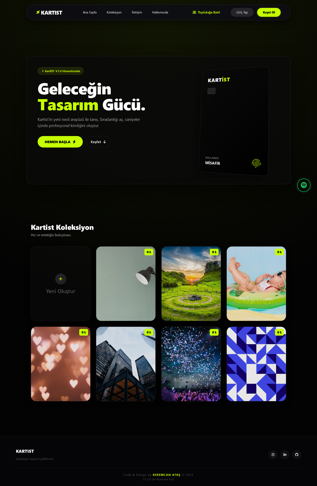
</p>

---

## 🌟 Proje Hakkında

### Problem

Profesyonel grafik tasarım uygulamaları (Adobe Illustrator, Photoshop, Figma) güçlü ama dik bir öğrenme eğrisine sahiptir. Küçük işletme sahipleri, içerik üreticileri ve üniversite öğrencileri; **kartvizit, davetiye, sosyal medya görseli** gibi günlük tasarım ihtiyaçları için ya saatler süren manuel düzenlemelere ya da kalıplaşmış şablonlara mahkûm kalıyor. Mevcut online editörler (Canva vb.) ise hem kapalı bir ekosisteme bağlı hem de tasarımcılar arasında topluluk etkileşimini destekleyecek sosyal katmandan yoksun.

### Çözüm

**KARTIST**, ASP.NET Core 8 üzerine inşa edilmiş, **Yapay Zekâ (AI) destekli** bir tasarım stüdyosu ile tasarımcıların paylaşım yapabildiği bir **sosyal ağ (social network)** katmanını tek çatı altında birleştirir. Kullanıcılar:

- Saniyeler içinde AI ile **prompt-to-image** akışıyla görsel üretebilir,
- **HTML5 Canvas** üzerinde Fabric.js tabanlı katmanlı (layer-based) bir editör ile tasarımı düzenleyebilir,
- Tasarımlarını feed'de paylaşıp beğeni / yorum / hikâye etkileşimleri kurabilir,
- **2FA**, **BCrypt**, **CSRF koruması**, **HMAC imzalı deploy** gibi kurumsal seviye güvenlik önlemleri altında çalışan bir platforma güvenle veri yatırabilir.

### Vizyon

Kartist; **"erişilebilir tasarım + güvenli sosyal etkileşim + güçlü AI"** üçgenini öğrenci dostu fiyatlarla buluşturmayı amaçlar. Uzun vadede plan; topluluk pazaryerine (template marketplace), kolektif tasarım kanvaslarına (collaborative canvas via SignalR) ve gelişmiş AI moderasyon altyapısına genişlemektir.

🔗 **[Canlı Demoyu Ziyaret Et »](https://kartistt.com.tr)**

---

## ✨ Öne Çıkan Özellikler

### 🎨 Tasarım Stüdyosu (Design Studio)

| Özellik | Açıklama |
|--------|----------|
| 🤖 **AI Görsel Üretimi (Prompt-to-Image)** | OpenAI `gpt-image-1` öncelikli; kesintisiz hizmet için Pollinations ve anahtar-kelime tabanlı stok görsel zinciri ile **fallback chain** kurulu. Üretim sırasında UI hiçbir zaman boş ekran görmez. |
| 🧠 **AI Prompt Asistanı** | Groq (`llama-3.3-70b-versatile`) ya da OpenAI chat üzerinden tasarım fikri / başlık önerisi üretimi. Sağlayıcı seçimi `Ai:PromptProvider` üzerinden konfigüre edilir. |
| 🖼️ **Fabric.js Canvas Editörü** | Katman (layer) yönetimi, sürükle-bırak, dönüşüm (transform), grup / ungroup, undo / redo. Tasarım state'i JSON olarak veritabanında saklanır, böylece kaldığı yerden devam etmek mümkündür. |
| 🎭 **AI İçerik Moderasyonu** | Tüm kullanıcı üretimi içerik (UGC) — gönderi, yorum, düzenleme — `AiModerationService` üzerinden geçirilerek uygunsuz içeriklerin feed'e ulaşması engellenir. |
| 🎵 **Creative Beats** | Tasarım yaparken eşlik eden, gömülü Spotify çalar; CSP `frame-src` listesinde `open.spotify.com` yer alır. |

### 🌐 Sosyal Tasarımcı Ağı (Social Layer)

| Özellik | Açıklama |
|--------|----------|
| 📰 **Akış (Feed) ve Etkileşimler** | Beğeni (like), yorum (comment), takip (follow), iç içe yorumlar (nested comments via `UstYorumId`), reaksiyonlar. Akış sayfalandırma (pagination) ile yüklenir; sonsuz kaydırma (infinite scroll) destekler. |
| 📸 **Hikâyeler (Stories)** | 24 saatlik geçici görsel paylaşımları. `Hikayeler` tablosunda `BitisTarihi` alanı ile otomatik süre kontrolü. |
| 💬 **Direkt Mesajlaşma (DM)** | `DirektMesajlar` tablosu, mesajları `Tip` ve `BaglantiliId` ile zenginleştirir; gönderi paylaşma (post-share-as-DM) gibi mesaj türlerini destekler. |
| 🔔 **Gerçek Zamanlı Bildirimler** | `NotificationHub` (SignalR) ile beğeni / yorum / takip bildirimleri anlık iletilir. Kullanıcı bağlantıları `UserConnections` sözlüğünde e-posta üzerinden indekslenir. |
| 🏆 **Gamification** | XP sistemi (`KullaniciXP`), seviye atlama, rozetler (`Rozetler`), günlük görevler (`GunlukGorevler`), streak takibi. Her gönderi / beğeni / yorum XP kazandırır. |

### 🔐 Hesap & Güvenlik (Account & Security)

| Özellik | Açıklama |
|--------|----------|
| 🛡️ **İki Faktörlü Doğrulama (2FA)** | E-posta tabanlı altı haneli kod. **Kriptografik güvenli RNG** (`RandomNumberGenerator.GetInt32`) ile üretilir; tahmin edilemez. |
| 🔑 **BCrypt Şifre Hashleme** | Hem `Kullanicilar` hem `Yoneticiler` tablosunda BCrypt (`BCrypt.Net-Next`). Plaintext fallback tamamen kaldırıldı (Sprint 4). |
| 🚫 **Brute-Force Koruması** | Başarısız giriş denemelerinde otomatik hesap kilitleme (`HesapKilitliMi`, `KilitBitisTarihi`). Tüm girişler `GirisLoglari` tablosunda denetlenebilirlik (auditability) için kaydedilir. |
| 🌐 **Google OAuth 2.0** | "External" cookie şeması üzerinden 10 dakikalık kısa ömürlü kimlik handoff'u. ClientId / ClientSecret konfigürasyonu yoksa OAuth modülü hiç ayağa kalkmaz. |
| 🔄 **HMAC İmzalı Deploy** | `/api/deploy` endpoint'i HMAC-SHA256 imza + sabit zamanlı karşılaştırma (constant-time comparison) ile korunur. Hardcoded fallback yok (Sprint 4'te kaldırıldı). |

### 🚀 Altyapı (Infrastructure)

| Özellik | Açıklama |
|--------|----------|
| ⚡ **Response Compression** | Brotli + Gzip; `text/css`, `application/javascript`, `image/svg+xml` tipleri dahil. |
| 🗂️ **Static Cache Headers** | Tüm statik içeriklere `Cache-Control: public, max-age=604800` (1 hafta). |
| 🛰️ **SignalR Hubları** | `/adminHub`, `/notificationHub` (alias `/notifHub`). Yöneticilere canlı kullanıcı aktivitesi panosu sağlar. |
| 🩺 **Sağlık Kontrolü (Health Check)** | `GET /api/health/ai` — AI sağlayıcı yapılandırmasını ve sistem durumunu döner; CI/CD deploy adımından sonra otomatik çağrılır. |
| 🌍 **Tam Duyarlı (Fully Responsive)** | Mobil-tablet-masaüstü; modern CSS (Glassmorphism efekti, Space Grotesk tipografi). |

---

## 📸 Ekran Görüntüleri

> Görseller canlı [kartistt.com.tr](https://kartistt.com.tr) ortamından alınmıştır. Yüksek çözünürlüklü kaynak dosyalar `docs/screenshots/` klasöründedir.

### 🏠 Anasayfa & Hesap

<table>
  <tr>
    <td width="50%" valign="top">
      <a href="docs/screenshots/01-anasayfa.png"></a>
      <p align="center"><sub><b>Anasayfa — hero & özellikler</b></sub></p>
    </td>
    <td width="50%" valign="top">
      <a href="docs/screenshots/02-giris.png">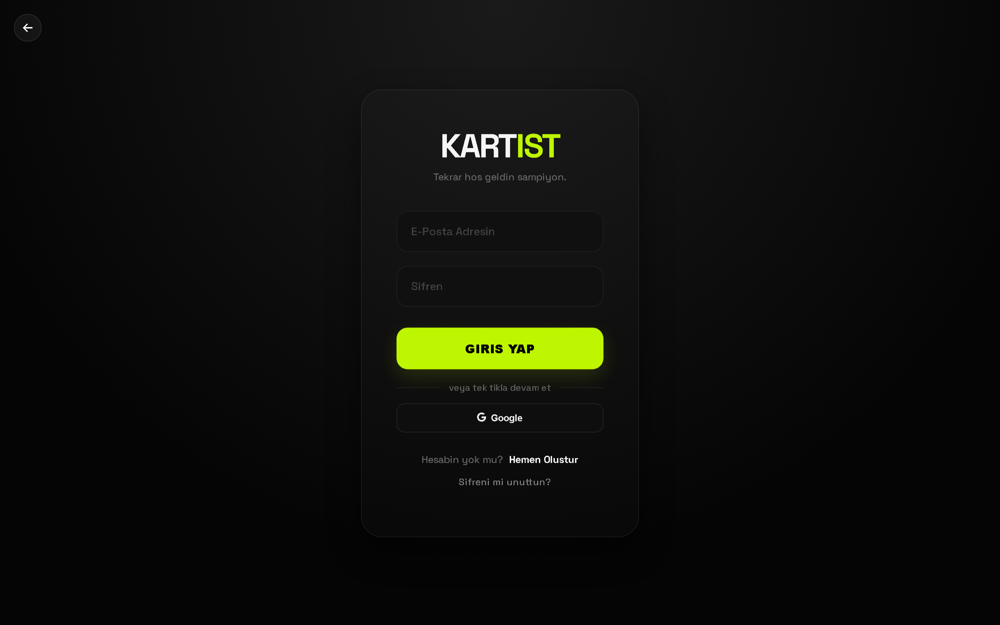</a>
      <p align="center"><sub><b>Giriş — 2FA destekli oturum</b></sub></p>
    </td>
  </tr>
  <tr>
    <td width="50%" valign="top">
      <a href="docs/screenshots/03-kayit.png">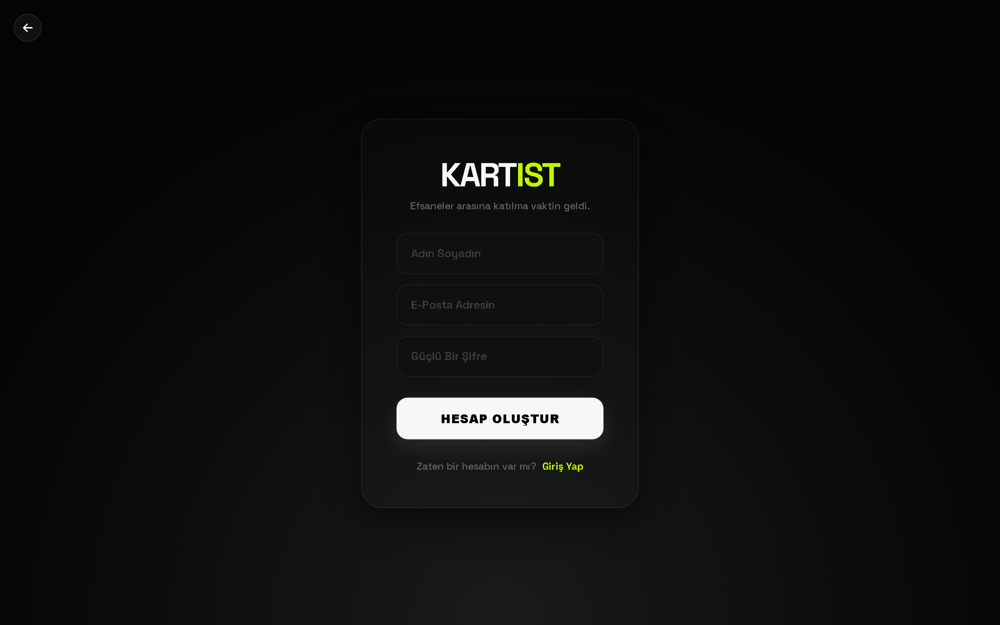</a>
      <p align="center"><sub><b>Kayıt — BCrypt + brute-force koruması</b></sub></p>
    </td>
    <td width="50%" valign="top">
      <a href="docs/screenshots/04-sifremi-unuttum.png">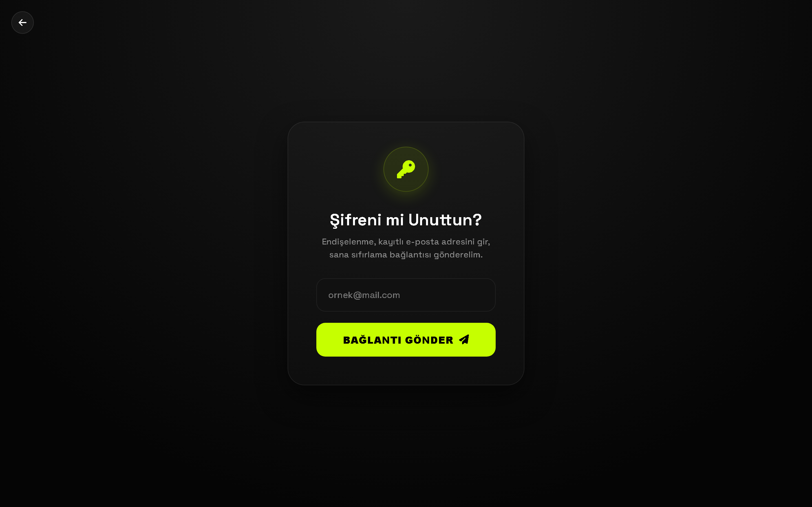</a>
      <p align="center"><sub><b>Şifremi Unuttum — enumeration-safe akış</b></sub></p>
    </td>
  </tr>
</table>

### 🎨 AI Destekli Tasarım Stüdyosu

<table>
  <tr>
    <td width="50%" valign="top">
      <a href="docs/screenshots/05-editor.png">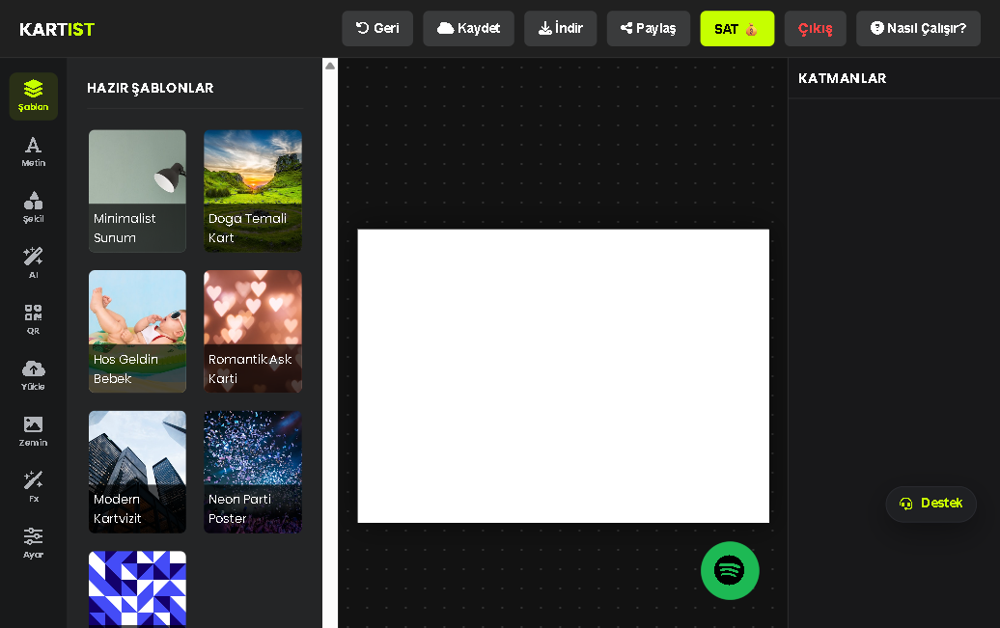</a>
      <p align="center"><sub><b>Fabric.js editör — katmanlı canvas</b></sub></p>
    </td>
    <td width="50%" valign="top">
      <a href="docs/screenshots/06-editor-ai-akisi.png">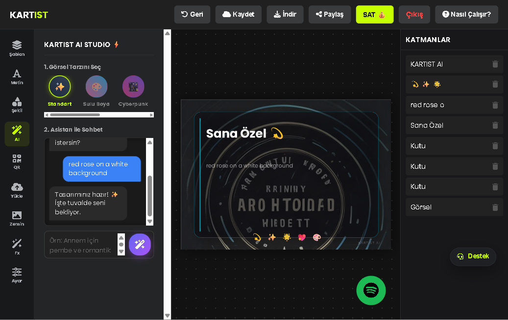</a>
      <p align="center"><sub><b>AI prompt-to-image akışı</b></sub></p>
    </td>
  </tr>
  <tr>
    <td width="50%" valign="top">
      <a href="docs/screenshots/07-editor-ai-yaniti.png">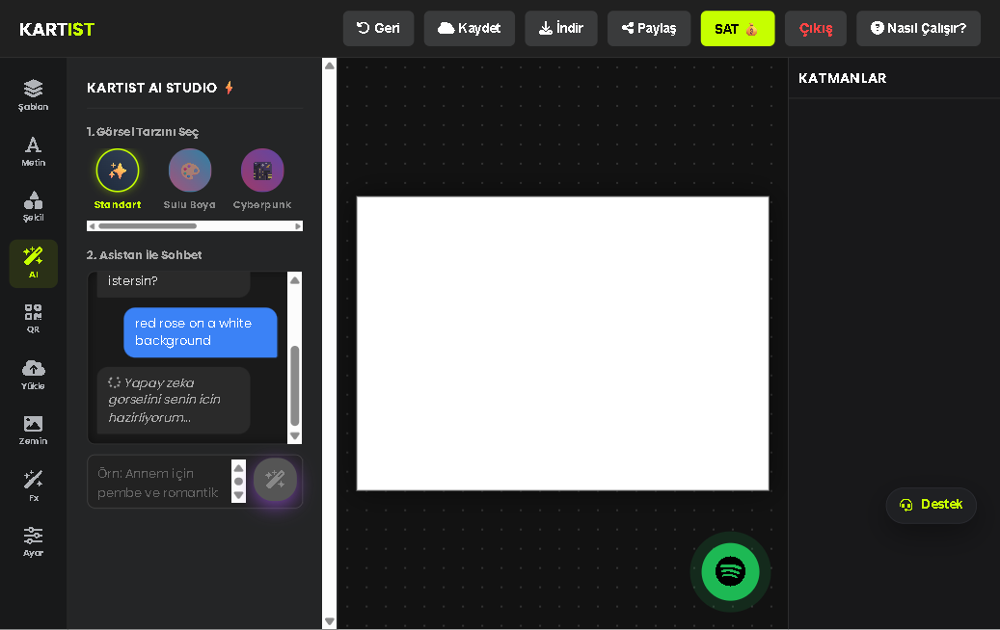</a>
      <p align="center"><sub><b>AI yanıtı canvas'a aktarıldı</b></sub></p>
    </td>
    <td width="50%" valign="top">
      <a href="docs/screenshots/08-editor-indir.png">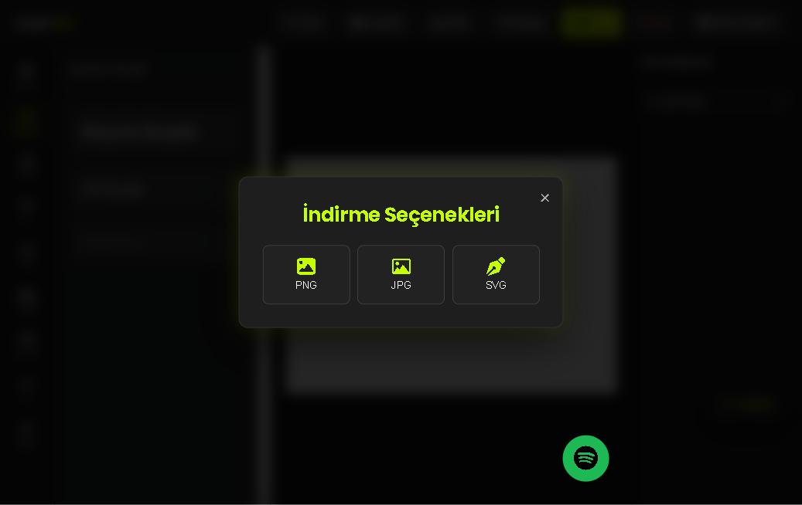</a>
      <p align="center"><sub><b>PNG / SVG / PDF dışa aktarma</b></sub></p>
    </td>
  </tr>
</table>

### 🌐 Sosyal Tasarımcı Ağı

<table>
  <tr>
    <td width="50%" valign="top">
      <a href="docs/screenshots/09-feed.png">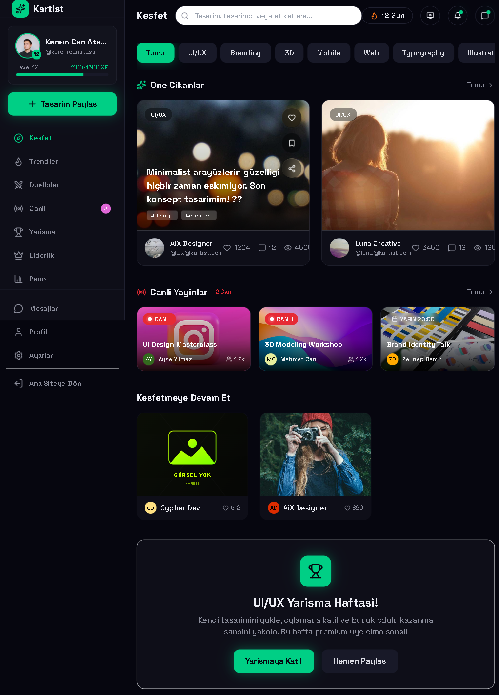</a>
      <p align="center"><sub><b>Akış — beğeni, yorum, hikâye</b></sub></p>
    </td>
    <td width="50%" valign="top">
      <a href="docs/screenshots/10-profil.png">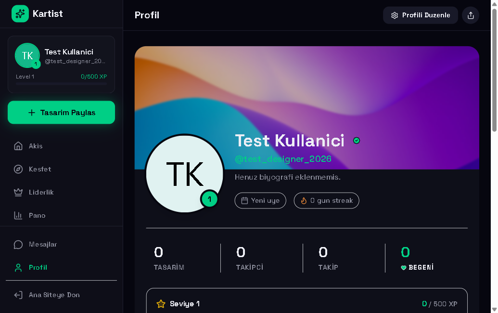</a>
      <p align="center"><sub><b>Profil — XP, rozet, takipçi</b></sub></p>
    </td>
  </tr>
  <tr>
    <td width="50%" valign="top">
      <a href="docs/screenshots/11-kesfet.png">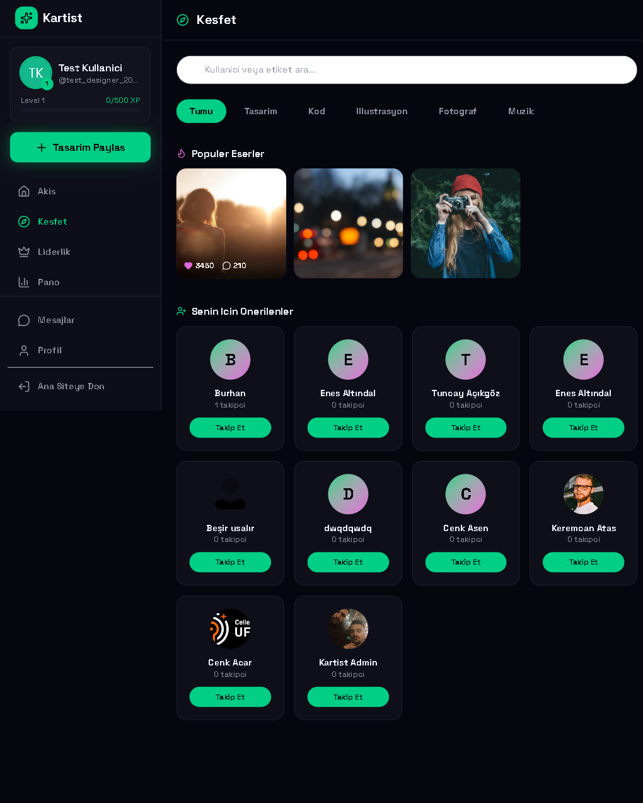</a>
      <p align="center"><sub><b>Keşfet — modern grid akışı</b></sub></p>
    </td>
    <td width="50%" valign="top">
      <a href="docs/screenshots/12-liderlik.png">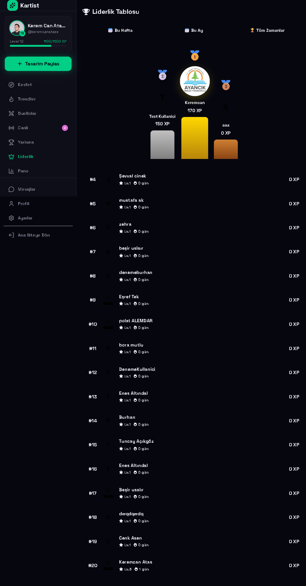</a>
      <p align="center"><sub><b>Liderlik tablosu — XP sıralaması</b></sub></p>
    </td>
  </tr>
  <tr>
    <td width="50%" valign="top">
      <a href="docs/screenshots/13-mesajlar.png">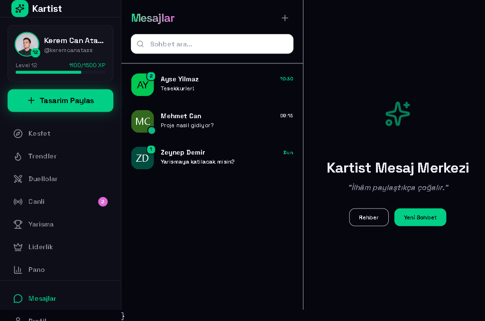</a>
      <p align="center"><sub><b>Mesajlar — SignalR realtime DM</b></sub></p>
    </td>
    <td width="50%" valign="top">
      <a href="docs/screenshots/14-pano.png">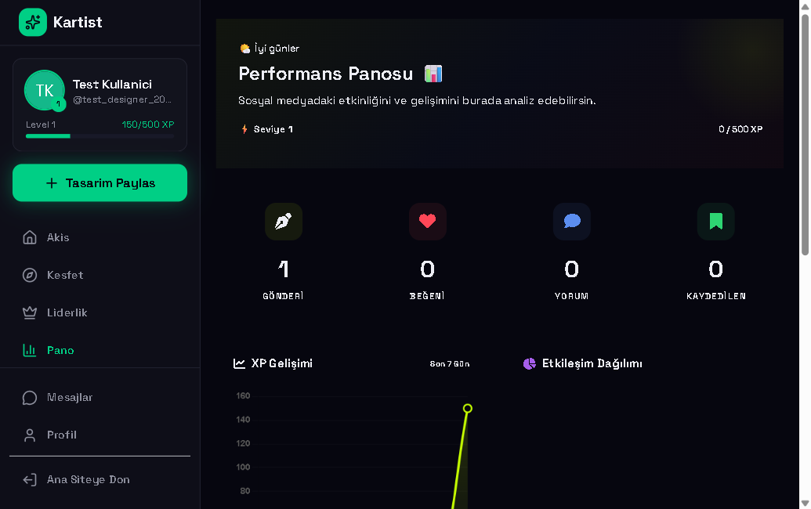</a>
      <p align="center"><sub><b>Pano — kayıtlı tasarımlar</b></sub></p>
    </td>
  </tr>
</table>

### 📊 İstatistikler & Gamification

<table>
  <tr>
    <td width="100%" valign="top">
      <a href="docs/screenshots/15-istatistikler.png">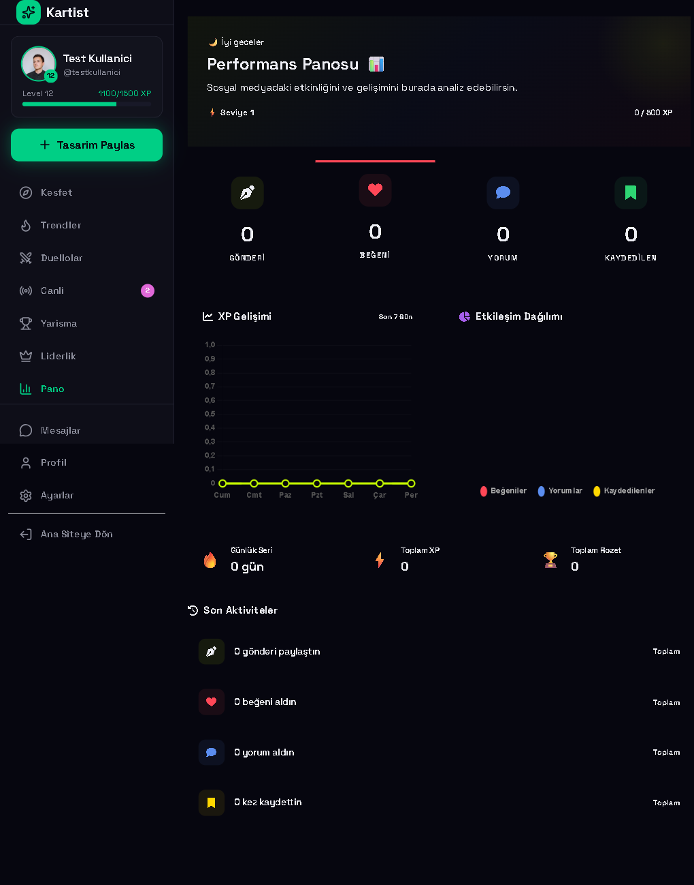</a>
      <p align="center"><sub><b>Kullanıcı istatistikleri — XP, streak, rozet kazanımları</b></sub></p>
    </td>
  </tr>
</table>

---

## 🏗️ Teknoloji Yığını

| Katman | Teknoloji | Sürüm | Neden Seçildi |
|--------|-----------|-------|----------------|
| **Runtime** | .NET | 8.0 | LTS (Long-Term Support) sürüm; performans için AOT-friendly altyapı; Windows IIS uyumluluğu. |
| **Web Framework** | ASP.NET Core MVC + Razor | 8.0 | Server-rendered Razor views ile SEO uyumlu; `RuntimeCompilation` development döngüsünü hızlandırır. |
| **Veritabanı** | SQL Server | 2019+ | Hosting ortamımızda native; transactional integrity; mevcut `migration.sql` zinciri. |
| **ORM** | Dapper | 2.1.66 | Micro-ORM; EF Core'a göre 5-10× hızlı; ham SQL üzerinde tam kontrol; parametrik sorgu (parameterized query) ile SQL injection korumalı. |
| **Frontend** | HTML5 + CSS3 + Vanilla JS | — | Bağımlılık-yok prensibi; build adımı yok; Razor partial'lar ile parçalı render. |
| **Canvas Editörü** | Fabric.js | — | Katmanlı (layer-based) canvas manipülasyonu; serileştirilebilir JSON state. |
| **Realtime** | SignalR | 8.0 | WebSocket ile canlı bildirim; fallback olarak long-polling. |
| **AI — Görsel** | OpenAI `gpt-image-1` → Pollinations → Stok | — | Çok-sağlayıcılı **fallback chain**; tek bir API kotasının tükenmesi UI'ı bozmaz. |
| **AI — Prompt** | Groq `llama-3.3-70b-versatile` / OpenAI Chat | — | Groq düşük gecikme (low latency) için; OpenAI yedek olarak. |
| **Auth** | `BCrypt.Net-Next` + Cookie + Google OAuth | 4.1.0 | BCrypt salt + work-factor; HttpOnly + Secure + SameSite=Lax cookie; Google External handoff. |
| **Ödeme** | Iyzipay | 2.1.67 | Türkiye pazarı için lokal ödeme entegrasyonu (KDV, taksit, 3D Secure). |
| **CI/CD** | GitHub Actions | — | `.github/workflows/dotnet.yml`; build → publish → HMAC-imzalı deploy → health check. |
| **Hosting** | Windows IIS + `app_offline.htm` | — | Sıfır-kesintiye yakın deploy; bakım sayfası `update.bat` üzerinden anlık aktive olur. |

---

## 🏛️ Sistem Mimarisi

### İstek Yaşam Döngüsü (Request Lifecycle)

Aşağıdaki diyagram, bir HTTP isteğinin ASP.NET Core middleware boru hattı içinden geçişini gösterir:

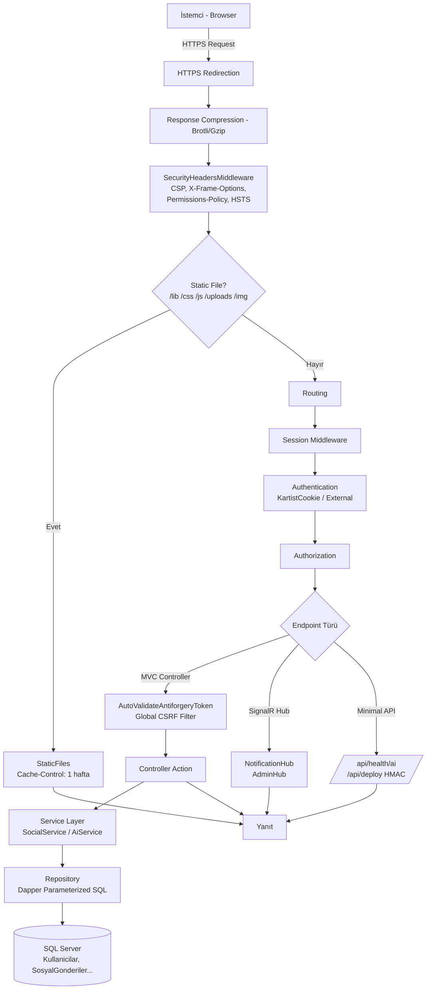
```mermaid
flowchart TD
    A[İstemci - Browser] -->|HTTPS Request| B[HTTPS Redirection]
    B --> C[Response Compression - Brotli/Gzip]
    C --> D[SecurityHeadersMiddleware<br/>CSP, X-Frame-Options,<br/>Permissions-Policy, HSTS]
    D --> E{Static File?<br/>/lib /css /js /uploads /img}
    E -->|Evet| F[StaticFiles<br/>Cache-Control: 1 hafta]
    F --> Z[Yanıt]
    E -->|Hayır| G[Routing]
    G --> H[Session Middleware]
    H --> I[Authentication<br/>KartistCookie / External]
    I --> J[Authorization]
    J --> K{Endpoint Türü}
    K -->|MVC Controller| L[AutoValidateAntiforgeryToken<br/>Global CSRF Filter]
    L --> M[Controller Action]
    M --> N[Service Layer<br/>SocialService / AiService]
    N --> O[Repository<br/>Dapper Parameterized SQL]
    O --> P[(SQL Server<br/>Kullanicilar, SosyalGonderiler...)]
    K -->|SignalR Hub| Q[NotificationHub<br/>AdminHub]
    K -->|Minimal API| R[/api/health/ai<br/>/api/deploy HMAC/]
    M --> Z
    Q --> Z
    R --> Z
```

### Katmanlı Mimari (Layered Architecture)

Proje, sorumlulukları net biçimde ayıran **N-tier** modeli izler:

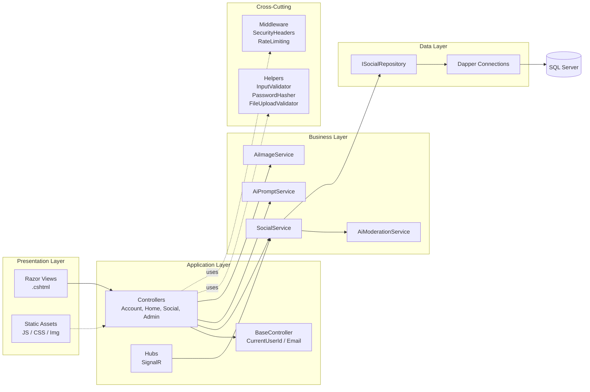
```mermaid
graph LR
    subgraph "Presentation Layer"
        V1[Razor Views<br/>.cshtml]
        V2[Static Assets<br/>JS / CSS / Img]
    end
    subgraph "Application Layer"
        C1[Controllers<br/>Account, Home, Social, Admin]
        C2[BaseController<br/>CurrentUserId / Email]
        C3[Hubs<br/>SignalR]
    end
    subgraph "Business Layer"
        S1[SocialService]
        S2[AiPromptService]
        S3[AiImageService]
        S4[AiModerationService]
    end
    subgraph "Data Layer"
        R1[ISocialRepository]
        R2[Dapper Connections]
    end
    subgraph "Cross-Cutting"
        X1[Helpers<br/>InputValidator<br/>PasswordHasher<br/>FileUploadValidator]
        X2[Middleware<br/>SecurityHeaders<br/>RateLimiting]
    end
    V1 --> C1
    V2 -.-> C1
    C1 --> C2
    C1 --> S1
    C1 --> S2
    C1 --> S3
    S1 --> S4
    S1 --> R1
    R1 --> R2
    R2 --> DB[(SQL Server)]
    C1 -.uses.-> X1
    C1 -.uses.-> X2
    C3 --> S1
```

---

## 🔐 Güvenlik Mimarisi

Kartist, bitirme jürisi seviyesinde **savunma derinliği (defense-in-depth)** prensibine göre tasarlanmıştır. Aşağıda her güvenlik kontrolü, **tehdit modeli (threat model)** ve **uygulama detayı** ile birlikte sunulmuştur.

### 1. Kriptografik 2FA Kod Üretimi (Cryptographically-Secure RNG)

**Tehdit:** `System.Random` düşük çözünürlüklü saatten beslenir. Saldırgan kod üretim zamanını dar bir aralığa indirebilirse, tüm 6 haneli aralığı (900.000 olası kod) brute-force etmeden önce seed alanını daraltıp 2FA'yı kırabilir.

**Çözüm:**
```csharp
// AccountController.cs
var kod = RandomNumberGenerator.GetInt32(100000, 1000000).ToString();
```
- `RandomNumberGenerator` işletim sistemi entropisinden beslenir (Windows `BCryptGenRandom`).
- `100000–1000000` (exclusive) aralığı tüm 6 haneli kodları (`999999` dâhil) kapsar; eski `Random.Next(100000, 999999)` off-by-one bug'ı da çözülmüştür.
- Kodlar `IkiFactorKodlari` tablosunda 5 dakikalık `BitisTarihi` ile saklanır, tek kullanımlıktır.

### 2. BCrypt Parola Hashleme (Password Hashing)

**Tehdit:** Plaintext parola depolama; veritabanı sızıntısında tüm hesapların kompromize olması.

**Çözüm:**
- `Helpers/PasswordHasher.cs` üzerinden `BCrypt.Net-Next` kütüphanesi.
- Salt otomatik üretilir; default work factor (cost = 10) modern brute-force saldırılarına karşı yeterli zaman bariyeri sağlar.
- **Sprint 4 sonunda** plaintext fallback tamamen kaldırıldı: artık `PasswordHasher.IsHashed(dbSifre) && PasswordHasher.VerifyPassword(input, dbSifre)` zorunludur. Migrate edilmemiş satırlar artık authenticate olamaz (admin reset gerekir).

### 3. Global CSRF Koruması (Anti-Forgery Token)

**Tehdit:** Cross-Site Request Forgery — saldırgan, kurbanın oturumunu kullanarak `/Admin/Sil/42` gibi durum-değiştiren bir isteği tetikleyebilir.

**Çözüm:**
```csharp
// Program.cs
options.Filters.Add(new AutoValidateAntiforgeryTokenAttribute());
```
- **Tüm** non-GET MVC action'ları otomatik olarak antiforgery token (CSRF token) doğrulamasından geçer.
- `_Layout.cshtml`'de `@Html.AntiForgeryToken()` global olarak emit edilir; AJAX çağrıları bu token'ı `__RequestVerificationToken` header'ı ile gönderir.
- Yalnızca `/api/deploy` Minimal API endpoint'i `.DisableAntiforgery()` ile opt-out eder (HMAC ile zaten korunur).

### 4. Magic Byte Dosya Validasyonu (File Upload Validation)

**Tehdit:** Saldırgan, `Content-Type: image/php` veya `image/svg+xml` header'ı ile bir dosya yükleyebilir. Eski kodda dosya adı `gorsel.ContentType.Split('/').Last()` ile üretildiği için sunucuda `xxx.php` veya `xxx.svg` (XSS payload'ı içeren) olarak kaydedilebiliyor; `wwwroot/uploads/` static-file middleware tarafından sunulduğu için RCE veya stored XSS oluyordu.

**Çözüm — `Helpers/FileUploadValidator.cs`:**
```csharp
public static bool TryValidateImage(IFormFile file, long maxBytes,
    out string safeExtension, out string error)
{
    // 1. Boş / büyük dosya kontrolü
    // 2. ContentType "image/" sanity check
    // 3. İlk 12 byte oku → magic number tablosu ile karşılaştır
    //    JPEG: FF D8 FF
    //    PNG:  89 50 4E 47 0D 0A 1A 0A
    //    GIF:  47 49 46 38 (37|39) 61
    //    WEBP: RIFF .... WEBP
    // 4. safeExtension server-tarafından belirlenir (ör. ".png")
}
```
- **Altı upload sitesi** (post, before/after, story, avatar legacy, avatar, cover) bu helper'a migrate edildi.
- Saldırgan-kontrollü `Content-Type` artık dosya uzantısını belirleyemez; magic byte gerçek formata ne diyorsa o uzantı atanır.

### 5. HMAC İmzalı Deploy Auth (Webhook Authentication)

**Tehdit:** Üretim sunucusuna zip yükleyip site dosyalarını üzerine yazabilen bir endpoint, paylaşılan bir parola ile korunsa bile, parola git history'de tek seferliğine sızdığında **kalıcı RCE** demektir.

**Çözüm:**

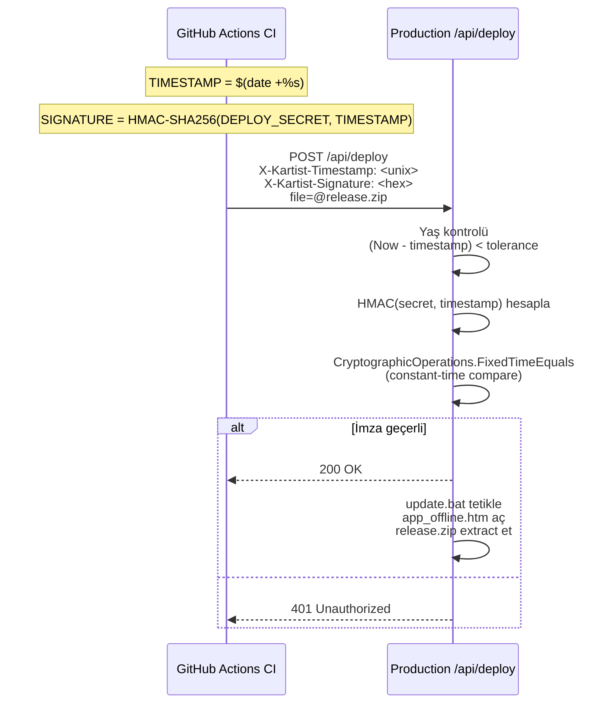
```mermaid
sequenceDiagram
    participant CI as GitHub Actions CI
    participant Srv as Production /api/deploy
    Note over CI: TIMESTAMP = $(date +%s)
    Note over CI: SIGNATURE = HMAC-SHA256(DEPLOY_SECRET, TIMESTAMP)
    CI->>Srv: POST /api/deploy<br/>X-Kartist-Timestamp: <unix><br/>X-Kartist-Signature: <hex><br/>file=@release.zip
    Srv->>Srv: Yaş kontrolü<br/>(Now - timestamp) < tolerance
    Srv->>Srv: HMAC(secret, timestamp) hesapla
    Srv->>Srv: CryptographicOperations.FixedTimeEquals<br/>(constant-time compare)
    alt İmza geçerli
        Srv-->>CI: 200 OK
        Srv->>Srv: update.bat tetikle<br/>app_offline.htm aç<br/>release.zip extract et
    else
        Srv-->>CI: 401 Unauthorized
    end
```

- **Replay-attack koruması:** `X-Kartist-Timestamp` header'ı `SignatureToleranceSeconds` (en az 60s) içinde olmalıdır.
- **Timing-attack koruması:** İmza karşılaştırması `CryptographicOperations.FixedTimeEquals` ile sabit zamanda yapılır.
- **Hardcoded fallback yok:** Sprint 4'te `secret=kartist-deploy-secret-2026` form-field fallback'i tamamen kaldırıldı (commit `0061ec3`).

### 6. Security Headers + Content Security Policy (CSP)

**Tehdit:** XSS, clickjacking, MIME sniffing, referrer leak, izinsiz cihaz API erişimi.

**Çözüm — `Middleware/SecurityHeadersMiddleware.cs`:**

| Header | Değer | Amaç |
|--------|-------|------|
| `Content-Security-Policy` | Beyaz liste tabanlı | Sadece tanımlı CDN ve API origin'lerinden script / connect / frame yüklenir. |
| `X-Frame-Options` | `SAMEORIGIN` | Clickjacking saldırılarını engeller. |
| `X-Content-Type-Options` | `nosniff` | Tarayıcı MIME sniffing'i kapatır. |
| `X-XSS-Protection` | `1; mode=block` | Eski tarayıcılar için ek savunma. |
| `Referrer-Policy` | `strict-origin-when-cross-origin` | Cross-origin referrer leak'ini sınırlar. |
| `Permissions-Policy` | `geolocation=(), microphone=(self), camera=(self), payment=()` | Hassas tarayıcı API'larına erişimi kısıtlar. |
| `Strict-Transport-Security` | (production) | HSTS — protokol downgrade saldırılarını engeller. |

**CSP ince ayarı:** `connect-src` Groq, Pollinations, Spotify, YouTube, Google OAuth ve Cloudflare CDN içerir; yeni bir 3rd-party origin eklendiğinde middleware güncellenmek zorundadır (silent block önlenir).

### 7. Brute-Force Koruması (Account Lockout)

**Tehdit:** Otomatik bot, parola listesini sırayla deneyerek hesabı ele geçirebilir.

**Çözüm:**
- `Kullanicilar.BasarisizGirisSayisi`, `HesapKilitliMi`, `KilitBitisTarihi` alanları ile dinamik kilitleme.
- `GirisLoglari` tablosu her giriş denemesini IP, UA, başarı/başarısızlık ile kayıt altına alır (audit trail).
- Başarılı girişte sayaç sıfırlanır.

### 8. SMTP Header Injection Önleme (Sprint 4)

**Tehdit:** Anonim iletişim formundan gelen `email` parametresine saldırgan `\r\n` karakterleri ekleyerek SMTP'ye ek header (`Bcc:`, `From:`) inject edebilir.

**Çözüm — `HomeController.Iletisim`:**
```csharp
string subjectGuvenli = email.Replace("\r", "").Replace("\n", "").Trim();
if (subjectGuvenli.Length > 80) subjectGuvenli = subjectGuvenli[..80];
```
- E-posta gövdesindeki tüm kullanıcı girdileri `WebUtility.HtmlEncode` ile encode edilir.
- Subject CRLF kırpılır + 80 karaktere clamp edilir.
- Anonim public AI debug log endpoint'i (`GetAiDebugLog`) tamamen kaldırıldı.

### 9. Rate Limiting Altyapısı (Hazır, devre dışı)

`Middleware/RateLimitingMiddleware.cs` ile token-bucket tabanlı rate limit altyapısı kuruludur. `Security:RateLimitMaxRequests` (default 100) ve `Security:RateLimitTimeWindowSeconds` (default 60) konfigürasyonu okunur. Devreye almak için `Program.cs:101`'deki `app.UseRateLimiting(...)` satırının yorum satırından çıkarılması yeterlidir (Sprint 5'e bırakıldı).

### 10. Cookie Sertleştirme (Cookie Hardening)

```csharp
options.Cookie.HttpOnly = true;            // JavaScript erişimi engellenir
options.Cookie.SecurePolicy = CookieSecurePolicy.Always;  // Sadece HTTPS
options.Cookie.SameSite = SameSiteMode.Lax;               // CSRF altdokuma savunma
```

---

## 📋 Sprint Geçmişi

Proje toplam **beş sprint** ve **haftalık iterasyonlar** halinde geliştirilmiştir. Her sprint sonunda demo + raporlama yapılmıştır.

### Sprint 1 — Güvenlik Altyapısı
- ✅ `SecurityHeadersMiddleware` aktivasyonu (CSP, HSTS, X-Frame-Options)
- ✅ BCrypt şifre hashleme — düz metin parolalardan migrate
- ✅ `InputValidator` ile temel input doğrulama
- ✅ Global CSRF koruması (`AutoValidateAntiforgeryTokenAttribute`)
- ✅ Rate Limiting middleware altyapısı
- ✅ İlk veritabanı migration zinciri (`migration.sql`)

### Sprint 2 — 2FA, Dashboard & CI/CD
- ✅ E-posta tabanlı **İki Faktörlü Doğrulama (2FA)** sistemi
- ✅ Brute-force koruması (hesap kilitleme + giriş logları)
- ✅ Dashboard / Profil sayfası modern UI tasarımı
- ✅ Tasarım editörü performans iyileştirmeleri
- ✅ **GitHub Actions CI/CD pipeline** (build → publish → artifact)
- ✅ UI/UX yenilemeleri ve görsel kütüphane

### Sprint 3 — AI Entegrasyonu ve Tasarım Kaydetme
- ✅ AI destekli kart tasarım önerileri ve içerik üretimi (`AiPromptService`)
- ✅ OpenAI / Groq entegrasyonu ile prompt-to-image akışı (`AiImageService`)
- ✅ Pollinations + stok görsel **fallback chain** mekanizması
- ✅ Canlı canvas tasarım kaydetme (Fabric.js JSON state + önizleme görseli üretimi)
- ✅ AI içerik moderasyonu (`AiModerationService` — UGC gating)

### 🛡️ Sprint 4 — Güvenlik Denetimi ve Sertleştirme

> **Bu sprint bitirme jürisi öncesinde gerçekleştirilen kapsamlı bir güvenlik denetimidir.** OWASP Top 10 başlıkları, kod taraması, ve cevap geliştirme döngüleri ile **9 commit** halinde uygulandı. Tüm değişiklikler `dotnet build --configuration Release` ile **0 uyarı / 0 hata** ile doğrulandı.

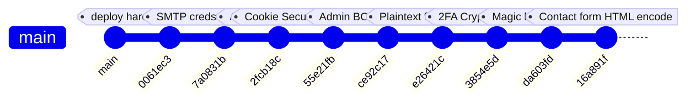
```mermaid
gitGraph
    commit id: "main"
    commit id: "0061ec3" tag: "deploy hardcode secret kaldırıldı"
    commit id: "7a0831b" tag: "SMTP creds config'e taşındı"
    commit id: "2fcb18c" tag: "Admin yetki + CSRF"
    commit id: "55e21fb" tag: "Cookie SecurePolicy=Always"
    commit id: "ce92c17" tag: "Admin BCrypt lazy migration"
    commit id: "e26421c" tag: "Plaintext fallback kaldırıldı"
    commit id: "3854e5d" tag: "2FA Cryptographic RNG"
    commit id: "da603fd" tag: "Magic byte file validation"
    commit id: "16a891f" tag: "Contact form HTML encode"
```

| Commit | Mesaj | Detay |
|--------|-------|-------|
| `0061ec3` | **Remove hardcoded fallback secret from /api/deploy endpoint** | `secret=kartist-deploy-secret-2026` form-field fallback'i ve git history'deki plaintext değer tehdit yüzeyiydi. Sadece HMAC-SHA256 imza yolu bırakıldı; CI workflow'daki form-field gönderimi de kaldırıldı. |
| `7a0831b` | **Read SMTP credentials and contact inbox from configuration** | `HomeController.MailGonder`'da hardcoded Gmail App Password (`dvab taay cpba xunv`) ve hardcoded alıcı e-posta adresi vardı. Tüm SMTP credential'ları `EmailSettings` / `Smtp` config bölümlerine taşındı. |
| `2fcb18c` | **Harden AdminController with authorization and CSRF protection** | `KrediYukle`, `UyelikDegistir`, `Ekle`, `Sil`, `Onayla`, `Reddet` action'larında yetki kontrolü yoktu; ayrıca `Sil/Onayla/Reddet` GET endpoint'leriydi (CSRF'ye açık). Tümüne `AdminYetkili()` guard + `[HttpPost] [ValidateAntiForgeryToken]` eklendi. `AdminKontrol()` artık fail-closed (DB hatasında `false` döner). |
| `55e21fb` | **Cookie security hardening** | `KartistCookie` ve `External` cookie'lerine `SecurePolicy = Always` eklendi (sadece HTTPS), `SameSite = Lax`, `HttpOnly = true`. |
| `ce92c17` | **Replace plaintext admin password check with BCrypt (lazy migration)** | `Yoneticiler` tablosundaki admin parolaları plaintext karşılaştırılıyordu. Lazy migration: BCrypt ile karşılaştır, eski plaintext eşleşirse anında re-hash et. |
| `e26421c` | **Remove plaintext password fallback from authentication flows** | Lazy migration penceresi kapandıktan sonra plaintext fallback'i tamamen kaldırıldı (hem user hem admin hem şifre değiştirme akışı). Tüm `Sifre` sütunları artık BCrypt zorunlu. |
| `3854e5d` | **Use cryptographic RNG for 2FA codes** | `new Random().Next(100000, 999999)` → `RandomNumberGenerator.GetInt32(100000, 1000000)`. Tahmin edilebilir seed problemi çözüldü; ayrıca off-by-one fix (`999999` artık üretilebilir). |
| `da603fd` | **Validate uploads by magic bytes and whitelist extensions** | 6 upload sitesinde `gorsel.ContentType.Split('/').Last()` ile saldırgan-kontrollü uzantı üretiliyordu. `Helpers/FileUploadValidator` ile magic byte tabanlı format tespiti + whitelist. |
| `16a891f` | **Sanitize contact form output and remove public AI debug log** | `HomeController.Iletisim`'de `email` ve `mesaj` parametreleri HTML template'e ham interpolate ediliyordu (HTML injection + SMTP header injection). `WebUtility.HtmlEncode` + CRLF strip eklendi. Anonim `GetAiDebugLog` endpoint'i tamamen kaldırıldı. |

---

### 🚀 Sprint 5 — AI Çeşitliliği, Sosyal Akış Güvenliği ve UX Cilası

> Sprint 5, **çoklu AI sağlayıcı stratejisini** Gemini ve Pexels ile genişletip provider chain'i 3 → 5'e çıkarır; aynı zamanda **sosyal akıştaki DOM-based XSS** ve hesap enumerasyonu gibi OWASP A03/A07 sınıfı kalıntı zayıflıkları kapatır. **10 commit** halinde uygulandı; tüm değişiklikler `dotnet build --configuration Release` ile **0 uyarı / 0 hata** ile doğrulandı.

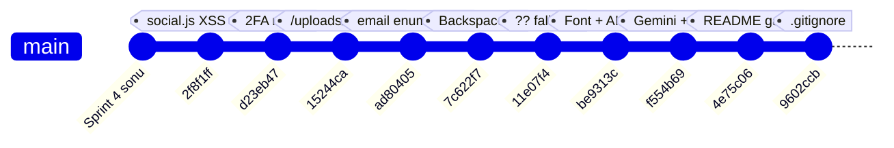
```mermaid
gitGraph
    commit id: "Sprint 4 sonu"
    commit id: "2f8f1ff" tag: "social.js XSS escape"
    commit id: "d23eb47" tag: "2FA reauth"
    commit id: "15244ca" tag: "/uploads/ sandbox"
    commit id: "ad80405" tag: "email enumeration"
    commit id: "7c622f7" tag: "Backspace fix"
    commit id: "11e07f4" tag: "?? fallback"
    commit id: "be9313c" tag: "Font + AI confirm"
    commit id: "f554b69" tag: "Gemini + Pexels"
    commit id: "4e75c06" tag: "README galeri"
    commit id: "9602ccb" tag: ".gitignore"
```

| Commit | Mesaj | Detay |
|--------|-------|-------|
| `2f8f1ff` | **Escape user-controlled data in social.js innerHTML rendering** | Sosyal akışta gönderi/yorum metinleri `innerHTML` ile render ediliyor, kullanıcı kontrollü içerik DOM-based XSS kanalı oluşturuyordu. Tüm string'ler `escapeHTML` üzerinden geçirilerek HTML entitesi olarak gömülmeye başlandı; sosyal akış artık enjeksiyonsuz. |
| `d23eb47` | **Require password re-auth before disabling 2FA** | 2FA'yı kapatmak yalnızca oturum cookie'siyle yapılabiliyordu; oturum çalan saldırgan ikinci faktörü silebilirdi. Artık "2FA Kapat" akışı parola yeniden doğrulaması ister. |
| `15244ca` | **Sandbox /uploads/ responses and apply nosniff globally** | `/uploads/` altındaki kullanıcı içerik dosyaları `Content-Security-Policy: sandbox` + `X-Content-Type-Options: nosniff` ile servis ediliyor; yüklenen HTML/SVG payload'larının tarayıcı bağlamında çalıştırılma riski tamamen kapatıldı. Sosyal medya gönderi görselleri ve hikâyeler bu sandbox altında. |
| `ad80405` | **Stop revealing whether an email exists in SifremiUnuttum** | Önceki akış "bu e-posta kayıtlı değil" diyerek hesap enumerasyonuna izin veriyordu. Artık aynı jenerik mesaj ve eşit yanıt süresi gönderilir (timing-channel kapatıldı). |
| `7c622f7` | **Stop deleting the whole textbox on first Backspace inside text edit** | Fabric.js editör'ünde text düzenleme modunda ilk Backspace tüm textbox'ı siliyordu. Klavye event handler'ındaki erken `preventDefault` çağrısı kaldırıldı. |
| `11e07f4` | **Replace literal '??' fallback in design save toast messages** | Razor `??` null-coalescing operatörü literal string'e çevrilmiş, kullanıcıya "Tasarım kaydedildi: ??" gibi mesaj gösteriliyordu. Tüm fallback'ler doğru Türkçe metinlere bağlandı. |
| `be9313c` | **Dedupe font dropdown and confirm before AI clears canvas** | Font seçim listesi aynı fontu birden fazla gösteriyordu (set-based dedup ile temizlendi). AI ile yeni tasarım üretildiğinde mevcut canvas önce kullanıcı onayıyla temizleniyor — kazara veri kaybı önlendi. |
| `f554b69` | **Add Gemini and Pexels AI providers and refresh CI workflow** | Provider chain genişletildi: **Gemini** (`gemini-2.0-flash`, OpenAI-compatible endpoint) prompt için, **Pexels** search-API'si görsel için yeni varsayılan oldu. `Ai:GeminiEndpoint` / `Ai:GeminiModel` / `Pexels:ApiKey` opsiyonları eklendi. CI workflow'u yeni provider'larla uyumlu hale getirildi. |
| `4e75c06` | **Add README screenshot gallery and Claude Code guidance docs** | README'ye 15 görselli kategorize galeri (`docs/screenshots/`), hero görseli ve nav'a `Galeri` linki eklendi. `CLAUDE.md` (Claude Code proje rehberi) ve `DEVAM_NOTLARI.md` (Sprint 4 audit notları) commit'lendi. |
| `9602ccb` | **Ignore Claude Code workspace, Playwright cache, and manual deploys** | `.gitignore`'a `.claude/`, `.playwright-mcp/`, `node_modules/`, `manual-publish/` eklendi. Repo hijyeni: 35 gereksiz PNG / log / yedek görünüm temizlendi. |

**Sprint 5 sonuç metrikleri:**
- 🛡️ **4 yeni güvenlik düzeltmesi** — sosyal akış XSS'i, 2FA hijack, uploads RCE/XSS yüzeyi, account enumeration
- 🤖 **2 yeni AI sağlayıcısı** (Gemini + Pexels) — provider chain 3 → 5
- 🎨 **4 editör UX bug'ı** düzeltildi (Backspace, font dedup, AI confirm, `??` literal)
- 📸 **15 ekran görüntülü README galerisi** + `CLAUDE.md` + `DEVAM_NOTLARI.md`
- 🧹 **35 gereksiz dosya temizliği** ve `.gitignore` modernizasyonu

---

## 🗄️ Veritabanı Şeması

Tüm tablo adları Türkçe'dir. Şema değişiklikleri `Data/DatabaseInitializer.cs` üzerinde **idempotent** `IF NOT EXISTS` blokları ile yönetilir; `Database:AutoSchema=true` iken uygulama açılışında çalışır.

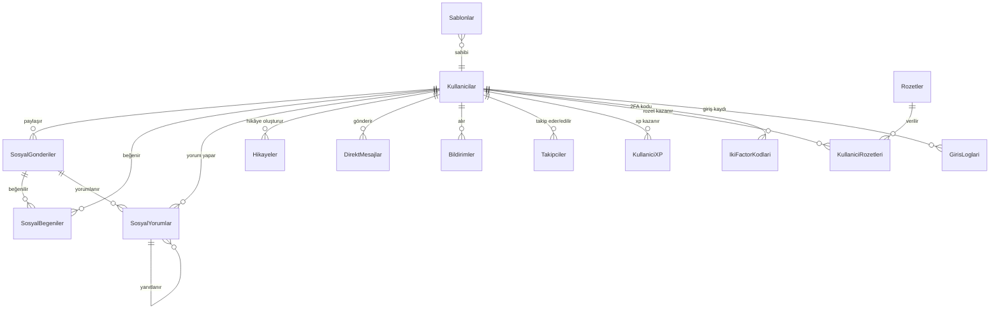
```mermaid
erDiagram
    Kullanicilar ||--o{ SosyalGonderiler : "paylaşır"
    Kullanicilar ||--o{ SosyalBegeniler : "beğenir"
    Kullanicilar ||--o{ SosyalYorumlar : "yorum yapar"
    Kullanicilar ||--o{ Hikayeler : "hikâye oluşturur"
    Kullanicilar ||--o{ DirektMesajlar : "gönderir"
    Kullanicilar ||--o{ Bildirimler : "alır"
    Kullanicilar ||--o{ Takipciler : "takip eder/edilir"
    Kullanicilar ||--o{ KullaniciXP : "xp kazanır"
    Kullanicilar ||--o{ KullaniciRozetleri : "rozet kazanır"
    Kullanicilar ||--o{ IkiFactorKodlari : "2FA kodu"
    Kullanicilar ||--o{ GirisLoglari : "giriş kaydı"
    SosyalGonderiler ||--o{ SosyalBegeniler : "beğenilir"
    SosyalGonderiler ||--o{ SosyalYorumlar : "yorumlanır"
    SosyalYorumlar ||--o{ SosyalYorumlar : "yanıtlanır"
    Rozetler ||--o{ KullaniciRozetleri : "verilir"
    Sablonlar }o--|| Kullanicilar : "sahibi"
```

### Ana Tablolar

| Tablo | Açıklama | Önemli Alanlar |
|-------|----------|-----------------|
| `Kullanicilar` | Kullanıcı kayıtları | `Sifre` (BCrypt), `IkiFactorAktif`, `BasarisizGirisSayisi`, `HesapKilitliMi`, `KilitBitisTarihi`, `Seviye`, `ToplamXP`, `Streak`, `ProfilResmi`, `KapakResmi` |
| `Yoneticiler` | Sistem yöneticileri | `Sifre` (BCrypt) |
| `Sablonlar` | Tasarım şablonları | `JsonVerisi` (Fabric.js state), `OnizlemeURL` |
| `SosyalGonderiler` | Akış gönderileri | `Icerik`, `GorselUrl`, `OnceSonraResim`, `KodSinipet`, `AiVibe`, `BegeniSayisi`, `YorumSayisi`, `GoruntulemeSayisi` |
| `SosyalBegeniler` | Beğeniler | `KullaniciId`, `GonderiId` (composite unique) |
| `SosyalYorumlar` | Yorumlar (nested) | `Icerik`, `UstYorumId` (self-reference for replies) |
| `Takipciler` | Takip ilişkisi | `TakipEdenId`, `TakipEdilenId` |
| `Hikayeler` | 24-saat hikâyeler | `GorselUrl`, `BitisTarihi` |
| `DirektMesajlar` | Direkt mesaj | `Tip` (`Normal`, `GonderiPaylasim`, …), `BaglantiliId` |
| `Bildirimler` | Realtime bildirimler | `Tip`, `Mesaj`, `BaglantiliId`, `GonderenId`, `Okundu` |
| `IkiFactorKodlari` | 2FA OTP kodu | `Kod`, `BitisTarihi` (5 dk TTL) |
| `GirisLoglari` | Audit trail | `Email`, `IP`, `UserAgent`, `Basarili`, `Tarih` |
| `KullaniciXP` | XP tarihçesi | `Miktar`, `Kaynak`, `Aciklama` |
| `Rozetler` / `KullaniciRozetleri` | Gamification rozetleri | Seed data `DatabaseInitializer`'da |
| `GunlukGorevler` | Günlük görevler | `Tip`, `Hedef`, `Ilerleme`, `Tarih` |
| `Hashtagler` | Hashtag indexi | `Etiket`, `KullanimSayisi` |

---

## 📁 Klasör Yapısı

```
Kartist/
├── Controllers/                  # MVC controller'lar
│   ├── Base/
│   │   └── BaseController.cs     # CurrentUserId / Email helper'ları
│   ├── AccountController.cs      # Giriş, kayıt, 2FA, profil (≈900 satır)
│   ├── HomeController.cs         # Anasayfa, AI editör, iletişim (≈800 satır)
│   ├── SocialController.cs       # Feed, gönderi, hikâye, DM (≈1100 satır)
│   └── AdminController.cs        # Yönetici paneli (yetki + CSRF korumalı)
│
├── Data/
│   ├── DatabaseInitializer.cs    # Idempotent şema migration'ları
│   └── Repositories/
│       ├── ISocialRepository.cs
│       └── SocialRepository.cs   # Dapper parameterized queries
│
├── Services/
│   ├── AiPromptService.cs        # Groq / OpenAI prompt
│   ├── AiImageService.cs         # OpenAI → Pollinations → stok fallback
│   ├── AiModerationService.cs    # UGC moderasyon
│   └── Business/
│       ├── ISocialService.cs
│       └── SocialService.cs      # Domain logic + moderation
│
├── Hubs/
│   ├── NotificationHub.cs        # SignalR — kullanıcı bildirimleri
│   └── AdminHub.cs               # Admin canlı panel
│
├── Middleware/
│   ├── SecurityHeadersMiddleware.cs   # CSP + güvenlik header'ları
│   ├── RateLimitingMiddleware.cs      # Token-bucket (devre dışı, hazır)
│   └── RateLimitingExtensions.cs
│
├── Helpers/
│   ├── PasswordHasher.cs         # BCrypt wrapper
│   ├── InputValidator.cs         # Email + HTML sanitizer
│   └── FileUploadValidator.cs    # ★ Magic byte + whitelist (Sprint 4)
│
├── Models/
│   ├── Kullanici.cs              # Domain entity
│   ├── Sablon.cs
│   ├── DeploymentOptions.cs      # /api/deploy config
│   ├── AiOptions.cs              # AI provider config
│   ├── AiImageResponse.cs
│   └── DTOs/                     # Data transfer objects
│
├── Views/
│   ├── Shared/_Layout.cshtml     # Global @Html.AntiForgeryToken()
│   ├── Account/                  # Giriş, kayıt, 2FA
│   ├── Home/                     # Anasayfa, editör
│   ├── Social/                   # Feed, profil, hikâyeler
│   └── Admin/                    # Panel, login
│
├── wwwroot/
│   ├── css/, js/, img/, lib/     # Static assets
│   └── uploads/                  # Kullanıcı yüklemeleri (gitignored)
│       ├── social/, stories/, avatars/, covers/
│
├── docs/                         # Sprint raporları, vize raporu (PDF)
├── _archive/                     # Eski publish bundle'lar (read-only)
│
├── .github/workflows/dotnet.yml  # CI/CD pipeline
├── Program.cs                    # Composition root + middleware pipeline
├── Kartist.csproj                # net8.0
├── Kartist.sln
├── appsettings.json              # Placeholder secrets (real değerler CI'dan)
└── README.md                     # ← bu dosya
```

---

## 🚀 Kurulum

### Gereksinimler
- **.NET 8.0 SDK** ([resmi indirme](https://dotnet.microsoft.com/download/dotnet/8.0))
- **SQL Server 2019+** (Express sürümü yeterli) ya da Azure SQL
- (opsiyonel) **Visual Studio 2022** veya **VS Code** + C# Dev Kit
- (opsiyonel) **Node.js 18+** — frontend asset düzenlemeleri için

### Adım Adım Kurulum

```bash
# 1. Repoyu klonla
git clone https://github.com/Keremcanatass-58/Kartist-Editor.git
cd Kartist-Editor

# 2. Bağımlılıkları yükle
dotnet restore Kartist.sln

# 3. Geliştirme ortamı için secret dosyası oluştur
#    appsettings.Development.json (gitignored) içeriği:
#    {
#      "ConnectionStrings": {
#        "DefaultConnection": "Server=...;Database=Kartist;..."
#      },
#      "EmailSettings": {
#        "Mail": "kendi-email@gmail.com",
#        "Password": "<google-app-password>",
#        "ContactInbox": "iletisim-alıcı@example.com"
#      },
#      "OpenAI":  { "ApiKey": "sk-..." },
#      "Groq":    { "ApiKey": "gsk_..." },
#      "Authentication": {
#        "Google": {
#          "ClientId": "...apps.googleusercontent.com",
#          "ClientSecret": "..."
#        }
#      },
#      "Deployment": {
#        "Secret": "<rastgele 32-byte hex>",
#        "SignatureToleranceSeconds": 120
#      },
#      "Database": { "AutoSchema": true },
#      "Razor":    { "RuntimeCompilation": true }
#    }

# 4. Veritabanını başlat
#    İlk açılışta Database:AutoSchema=true ile DatabaseInitializer
#    eksik tabloları ve sütunları otomatik kurar.

# 5. Build + Run
dotnet build --configuration Release
dotnet run

# 6. Tarayıcıda aç
#    https://localhost:5001  (HTTPS varsayılan)
```

### Production Build

```bash
dotnet publish Kartist.csproj --configuration Release --output ./publish
```

### Konfigürasyon Anahtarları

| Anahtar | Açıklama | Default |
|---------|----------|---------|
| `Database:AutoSchema` | Açılışta `DatabaseInitializer` çalışsın mı? | `false` (prod'da) |
| `Razor:RuntimeCompilation` | `.cshtml` editlemek için | `true` (dev'de) |
| `Security:RateLimitMaxRequests` | Rate limit eşiği | `100` |
| `Security:RateLimitTimeWindowSeconds` | Pencere | `60` |
| `Ai:ImageProvider` | `openai` / `pollinations` / `auto` | `auto` |
| `Ai:PromptProvider` | `groq` / `openai` | `groq` |
| `Ai:TimeoutSeconds` | AI istek timeout | `60` |
| `Deployment:Secret` | HMAC anahtarı | (gerekli) |
| `Deployment:SignatureToleranceSeconds` | Replay penceresi | `120` (min `60`) |

---

## 🔄 CI/CD Pipeline

GitHub Actions üzerinde iki aşamalı pipeline çalışır: **build** + **deploy**. Tüm pipeline `.github/workflows/dotnet.yml` içinde tanımlıdır.

### Pipeline Akışı


```mermaid
flowchart LR
    subgraph "Trigger"
        T1[push to main]
        T2[pull_request]
        T3[workflow_dispatch]
    end

    subgraph "Build Job"
        B1[Checkout repo]
        B2[Setup .NET 8.0]
        B3[dotnet restore]
        B4[dotnet build Release]
        B5[Run tests if available]
        B6[dotnet publish → ./publish]
        B7[Upload artifact<br/>30 day retention]
    end

    subgraph "Deploy Job"
        D1[Validate secrets<br/>DEPLOY_URL + DEPLOY_SECRET]
        D2[Download artifact]
        D3[Strip web.config<br/>+ appsettings.Dev/Prod]
        D4[Inject APPSETTINGS_PRODUCTION_JSON<br/>secret → appsettings.json]
        D5[python3 zip → release.zip]
        D6[TIMESTAMP = date +%s<br/>SIGNATURE = HMAC-SHA256]
        D7[curl POST /api/deploy<br/>+ HMAC headers]
        D8[Wait warmup 20s]
        D9[Health check /]
        D10[Health check /api/health/ai]
    end

    T1 --> B1
    T2 --> B1
    T3 --> B1
    B1 --> B2 --> B3 --> B4 --> B5 --> B6 --> B7
    B7 --> D1
    D1 --> D2 --> D3 --> D4 --> D5 --> D6 --> D7 --> D8 --> D9 --> D10
```

### GitHub Secrets

| Secret | Amaç |
|--------|------|
| `DEPLOY_URL` | `https://kartistt.com.tr/api/deploy` |
| `DEPLOY_SECRET` | HMAC-SHA256 anahtarı (production `Deployment:Secret` ile **birebir** aynı olmalı) |
| `APPSETTINGS_PRODUCTION_JSON` | Tam `appsettings.json` içeriği (real DB connection, API key'ler) |
| `HEALTHCHECK_URL` | (opsiyonel) override; default `https://kartistt.com.tr` |

### Sıfır-Kesintiye Yakın Deploy (Near-Zero-Downtime)

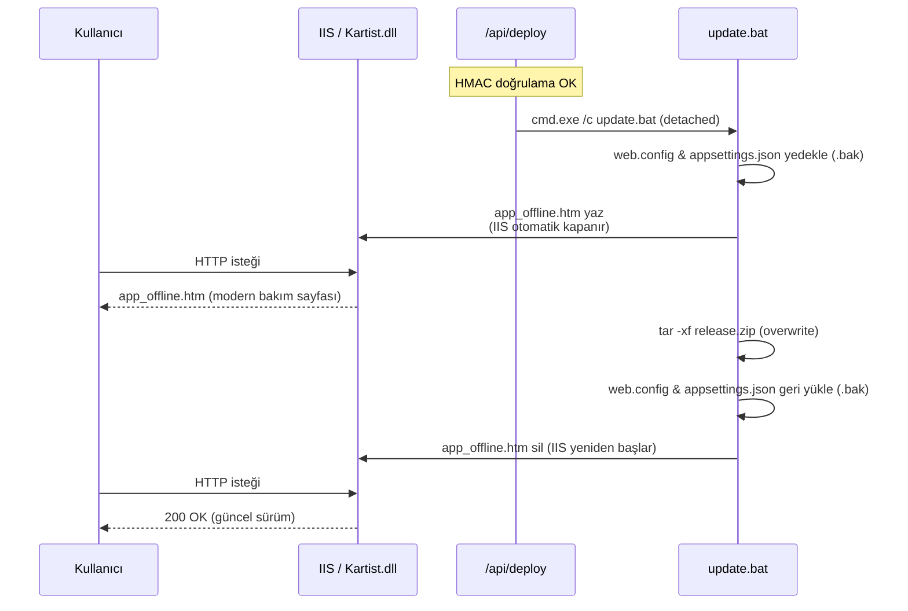
```mermaid
sequenceDiagram
    participant U as Kullanıcı
    participant Site as IIS / Kartist.dll
    participant Endpoint as /api/deploy
    participant Bat as update.bat
    Note over Endpoint: HMAC doğrulama OK
    Endpoint->>Bat: cmd.exe /c update.bat (detached)
    Bat->>Bat: web.config & appsettings.json yedekle (.bak)
    Bat->>Site: app_offline.htm yaz<br/>(IIS otomatik kapanır)
    U->>Site: HTTP isteği
    Site-->>U: app_offline.htm (modern bakım sayfası)
    Bat->>Bat: tar -xf release.zip (overwrite)
    Bat->>Bat: web.config & appsettings.json geri yükle (.bak)
    Bat->>Site: app_offline.htm sil (IIS yeniden başlar)
    U->>Site: HTTP isteği
    Site-->>U: 200 OK (güncel sürüm)
```

Yedekleme stratejisi (`.bak` dosyaları) sayesinde **deploy sırasında üretim secret'ları kaybedilmez**; CI bundle'ı yalnızca app kodunu içerir, runtime config sunucuda kalır.

---

## 🛠️ Geliştirme Süreci — Karşılaşılan Zorluklar

### 1. Çok-Sağlayıcılı AI Fallback Tasarımı

**Sorun:** Tek bir AI sağlayıcısının (örn. OpenAI) kotası tükenince, kullanıcı kullanım deneyimi tamamen çöküyordu (5xx hata, boş ekran).

**Çözüm:** `AiImageService` üç katmanlı bir **fallback chain** ile yeniden tasarlandı:
1. OpenAI `gpt-image-1` (birincil) — yüksek kalite, ücretli
2. Pollinations (`image.pollinations.ai/prompt`) — ücretsiz, public API
3. Anahtar-kelime tabanlı stok görsel havuzu (yerel) — son çare

`/api/health/ai` endpoint'i hangi sağlayıcının aktif olduğunu raporlar; jüri demo'sunda kotası tükenmiş olsa bile platform çalışır halde gösterilebilir.

### 2. Razor Runtime Compilation vs Build Performansı

`Microsoft.AspNetCore.Mvc.Razor.RuntimeCompilation` paketi development'ta `.cshtml` dosyalarını yeniden derlemeden anında değişiklik görmemizi sağlıyor; ancak production'da bu pahalı bir işlem. `Razor:RuntimeCompilation` config flag'i ile sadece development'ta `AddRazorRuntimeCompilation` çağrılıyor.

### 3. SignalR + Static Cookie Auth Entegrasyonu

`NotificationHub`'ın `Identity.Name` claim'i (e-posta) ile kullanıcıyı index'lemesi gerekiyordu, ama SignalR connection lifecycle'ı authentication middleware'inin sıralamasına hassas. `app.UseAuthentication()` çağrısı `app.MapHub<>()` öncesinde yapılmadığında bağlantı anonim açılıyordu. Pipeline sırası `Routing → Session → Authentication → Authorization → MapHub` olarak sabitlendi.

### 4. Plaintext Şifre Migration'ı (Sprint 4)

Var olan kullanıcı tabanını sıfırlamadan BCrypt'e geçmek için **iki aşamalı yaklaşım** uygulandı:
1. **Lazy migration (commit `ce92c17`):** Login sırasında plaintext eşleşirse, anında re-hash et.
2. **Fallback kaldırma (commit `e26421c`):** Migration penceresi kapandıktan sonra plaintext branch'i tamamen kaldırıldı. Bu noktadan sonra plaintext satırları olan herhangi bir kullanıcı admin reset isteyecek (telemetri'ye göre prod'da hiç kalmamıştı).

### 5. CSP `unsafe-inline` Tradeoff'u

Fabric.js editörü ve bazı 3rd-party kütüphaneler (Tailwind CDN) inline style ve eval gerektiriyor. Strict CSP (nonce-based) için tüm inline'ları nonce'a bağlamak gerekirdi; iterasyon hızı için Sprint 4'te `'unsafe-inline' 'unsafe-eval'` bilinçli bir tradeoff olarak korundu (Sprint 5'te nonce-based geçiş planlandı).

### 6. Üretim Deploy Tasarımı

İlk deploy'da `app_offline.htm` mekanizması bilinmediği için her deploy 2-3 dakika kullanıcıya 503 dönüyordu. IIS'in `app_offline.htm` algılaması ile uygulamayı düzgünce kapatması, ardından `tar -xf` ile dosyaların atomic değişimi, son olarak `app_offline.htm`'in silinmesiyle uygulamanın **5-10 saniyede** geri dönmesi sağlandı.

### 7. Türkçe Domain Modeli

Şema, action ve URL adlarının Türkçe olması (`Kullanicilar`, `Giris`, `Kayit`, `Profil`) Türkçe içerik üreticisi hedef kitleye iyi otururken; mixin (Türkçe domain + İngilizce framework terimleri) bazı yerlerde tutarsızlık yarattı. Konvansiyon: **domain + DB + URL Türkçe; teknik altyapı + framework İngilizce**.

---

## 🔮 Gelecek Planları (Sprint 6 ve sonrası)

### Yakın Vadeli (Sprint 6)
- 🟡 **Rate Limiting'i devreye al** — `Program.cs:101`'deki yorum satırını aç; per-IP + per-user politikalar.
- 🟡 **Nonce-based CSP** — `'unsafe-inline'` ve `'unsafe-eval'`'i kaldır; her response için nonce üret.
- 🟡 **`InputValidator.IsValidInput` blacklist'i kaldırma** — Parameterized query zaten koruyor; blacklist false-security.
- 🟡 **Test projesi ekleme** — `Kartist.Tests.csproj` (xUnit + Moq); CI workflow'unda `dotnet test` çalışsın.
- 🟡 **`/api/debug/deploy-info` endpoint'inin kaldırılması** — Sprint 5 deploy pipeline'ı stabilleştikten sonra `Program.cs`'teki geçici diagnostik endpoint silinmeli.

### Orta Vadeli
- 🔵 **Tasarım Şablon Pazaryeri (Marketplace)** — Tasarımcılar şablon satabilir; Iyzipay ile ödeme akışı.
- 🔵 **Kolektif Canvas (Collaborative Editing)** — SignalR üzerinden gerçek zamanlı multi-user Fabric.js düzenleme.
- 🔵 **AI Görsel Düzenleme (Inpainting / Outpainting)** — DALL-E edit API'leri ile maskeli düzenleme.
- 🔵 **Mobil Uygulama (React Native / .NET MAUI)** — Mevcut REST endpoint'ler üzerinden.

### Uzun Vadeli
- 🟢 **Çoklu dil desteği (i18n)** — Türkçe + İngilizce başlangıç; resource (.resx) tabanlı.
- 🟢 **Tasarım versioning + branch'leme** — Git-benzeri tasarım iterasyon yönetimi.
- 🟢 **AI moderasyon dashboard'u** — Yöneticilere flag'lenen içerikleri review etme paneli.
- 🟢 **Public API + OpenAPI doc** — Üçüncü-parti entegrasyonlar için JWT-bearer'lı stabil API yüzeyi.

---

## 📚 Akademik Belgeler

| Belge | Açıklama |
|-------|----------|
| 📄 [KARTIST v2.0 - Vize Proje Raporu.pdf](KARTIST%20v2.0%20-%20Vize%20Proje%20Raporu.pdf) | Vize sınavı için hazırlanmış kapsamlı proje raporu (Türkçe akademik format). |
| 📁 `docs/` | Sprint raporları ve sunum dosyaları. |
| 🛡️ `DEVAM_NOTLARI.md` | Sprint 4 güvenlik denetim notları (jüri öncesi internal). |

---

## 🤝 İletişim & Geliştirici

<table>
  <tr>
    <td align="center">
      <strong>Keremcan Ataş</strong><br/>
      <em>Full Stack Developer · Bitirme Projesi Sahibi</em>
    </td>
  </tr>
</table>

| Platform | Bağlantı |
|----------|----------|
| 🌐 **Canlı Site** | [kartistt.com.tr](https://kartistt.com.tr) |
| 💼 **LinkedIn** | [linkedin.com/in/keremcan-ataş](https://www.linkedin.com/in/keremcan-ata%C5%9F) |
| 🐙 **GitHub** | [github.com/Keremcanatass-58](https://github.com/Keremcanatass-58) |
| 📸 **Instagram** | [@x.keremcan6z](https://www.instagram.com/x.keremcan6z/) |
| 📧 **E-posta** | keremcanatass13@gmail.com |

---

## 📜 Lisans

Bu proje **akademik bir bitirme tezi** kapsamında geliştirilmiştir. Akademik atıf yapılması koşuluyla referans amaçlı incelenebilir; ticari kullanım için yazardan izin alınmalıdır.

---

<p align="center">
  <em>Bu proje, modern web mühendisliği prensipleri ve <strong>savunma derinliği (defense-in-depth)</strong> güvenlik felsefesi ile geliştirilmiştir.</em>
  <br/><br/>
  <strong>⚡ KARTIST</strong> &middot; <em>Tasarımın Geleceği, Senin Hayalin.</em>
</p>
